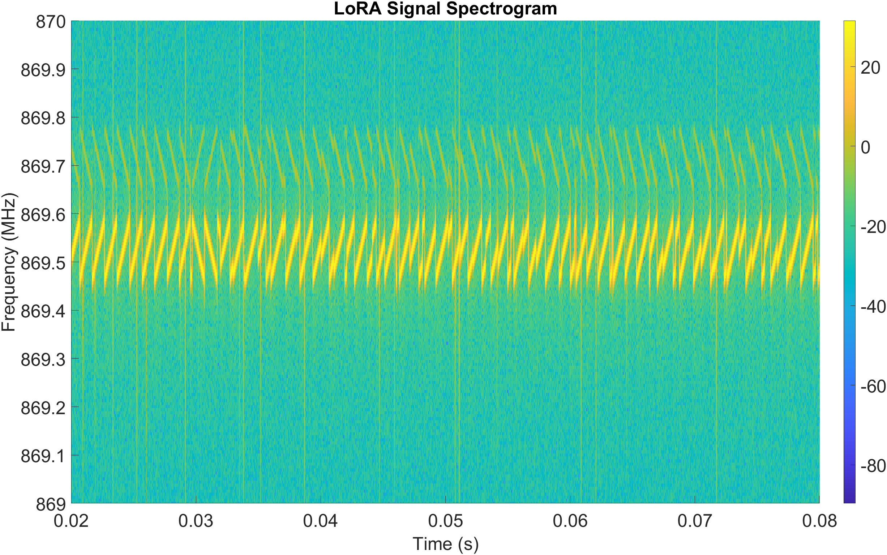

# Nautilus dashboard

Live plotting dashboard for the Nautilus boards. Understands both serial
formats and draws one chart per figure, in a section per format — sections
appear automatically when their kind of data shows up:

- **LoRa RX** (receiver board): temperature, PM1, PM2, flame, RSSI, SNR
- **Telemetry** (TX board): CO₂, temperature, humidity, PM1/PM2.5/PM4/PM10,
  flame ADC + digital, boost V/I/P, charger V/I/P, boost/buck duty,
  charge-current limit, fault flags — plotted against uptime

A raw serial feed panel at the bottom shows every line, parsed or not.

Two data sources:

- **fake** — replays a captured log file line by line (no hardware needed)
- **serial** — reads the live receiver over a COM port

## Quickstart

```sh
npm install

# fake mode with the bundled capture (loops forever, 1 line / 500 ms)
npm run fake

# fake mode with longer synthetic captures, faster replay
npm run demo      # LoRa RX lines
npm run demo:tx   # TX telemetry blocks

# live mode — run without --port first to list available COM ports
npm run serial
npm run serial -- --port COM5
```

Then open <http://localhost:3000>.

## Options

```
node server.js [options]

  --mode fake|serial   data source                       (default: fake)
  --http-port <n>      web UI port                       (default: 3000)

fake mode:
  --file <path>        log file to replay, relative to this folder
                                                         (default: data/sample-log.txt)
  --interval <ms>      delay between replayed lines      (default: 500)
  --no-loop            stop at end of file instead of looping

serial mode:
  --port <name>        serial port, e.g. COM5 (omit to list ports and exit)
  --baud <n>           baud rate                         (default: 115200, matches firmware)
```

## Expected formats

Receiver report (one line per packet):

```
LoRa RX #56: T=36.5 C, PM1=12.3, PM2=25.7 ug/m3, flame=512, RSSI=-107 dBm, SNR=7.7 dB
```

TX telemetry block (multi-line; `nan` values plot as gaps):

```
Telemetry sample:
  uptime_ms=151207
  SCD30 ok=1 CO2=0.0 ppm T=27.21 C RH=35.31 %
  SPS30 ok=0 PM1=nan PM2.5=nan PM4=nan PM10=nan
  flame_adc=23 flame_digital=1
  boost_input: V=0.556 I=0.0001 P=0.0000
  charger_input: V=3.565 I=0.0000 P=0.0001
  boost_duty=0.00% buck_duty=0.00% charge_current_limit_mA=10
  fault_flags=0x0
```

Both parsers live in [lib/parsers.js](lib/parsers.js). Lines that don't match
either format (boot messages, debug prints) still show up in the raw feed
panel, they just aren't plotted.

## UI

- **Window selector** — how many recent packets each chart shows; scopes all
  charts at once.
- **Pause** — freezes the charts for inspection; packets keep buffering and
  the charts catch up on resume.
- **Hover** — crosshair + tooltip with the exact value at any packet.
- **◐** — toggles light/dark; follows the OS setting until you override it.
- The dashboard survives server restarts and unplugged receivers — it
  reconnects automatically, and serial mode retries the port every 3 s.

## Files

- `server.js` — Express + Server-Sent Events; tails the file or the port
- `lib/parsers.js` — LoRa line parser + telemetry block assembler
- `public/` — the dashboard (Chart.js, served locally — works offline)
- `data/sample-log.txt` — short real RX capture
- `data/demo-long.txt`, `data/demo-telemetry.txt` — synthetic captures
  (regenerate: `node tools/gen-demo-data.js`)

## SDR LoRA Waveform Capture
Spectrogram of a waveform transmitted by LoRA.



